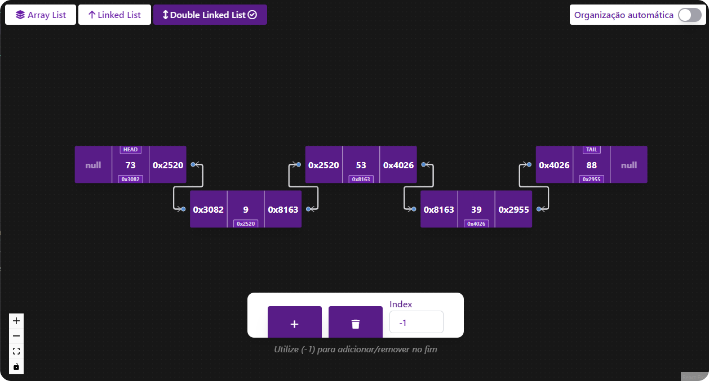

<h1 align="center">
  Data Structures Simulator | Lists
</h1>

<p align="center">
  
</p>

## 💻 Repositório

Este repositório tem como objetivo demonstrar a utilização e funcionamento dos principais métodos presentes nos dados estruturados de lista de forma visual e didática. O métodos são:

- [x] Adicionar no fim;
- [x] Adicionar no inicio;
- [x] Adicionar em um determinado índice;
- [x] Remover no fim;
- [x] Remover no inicio;
- [x] Remover em um determinado índice.

Clique [aqui](https://ds-simulator.netlify.app/) para acessar.

## ⚙️ Contribua

1. Realize um fork deste repositório e clone-o em sua máquina
2. Instale as dependências necessárias
```bash
npm i # ou yarn
```
- Execute-o em sua máquina
```bash
npm run dev
```

Pronto! Agora é só abrir um PR com as suas sugestões e/ou alterações. <br/>

Você também pode utilizar a seção de issues para reportar algum problema ou sugerir melhorias. Fique à vontade para contribuir como desejar.

## ⚙️ Referência/Inspiração

Desenvolvido durante o estudo das notas de aula apresentadas na disciplina de **Algoritmos e Estruturas de Dados I**, ofertada pelo Departamento de Engenharia de Computação e Automação da Universidade Federal do Rio Grande do Norte (_DCA/UFRN_).

- [@ErnaneJ/ED-I](https://github.com/ErnaneJ/ED-I)
- [@EduardoLFalcao/edi](https://github.com/eduardolfalcao/edi)